<p align="center">
  
</p>

<h1 align="center">Art Men's Salon — POS &amp; Accounts</h1>

<p align="center">
  A point-of-sale and bookkeeping system that replaced a paper register at a men's salon in Karachi:<br />
  counter billing, nightly cash reconciliation, staff ledgers, monthly accounts and partner profit shares —<br />
  and it keeps working for a full day with no internet.
</p>

<p align="center">
  <a href="https://github.com/Sakib543/art-man/actions/workflows/ci.yml"></a>
  
  
  
  
  
  
  
  
</p>

---

## Contents

- [Overview](#overview)
- [Screenshots](#screenshots)
- [Highlights](#highlights)
- [Features](#features)
- [Roles and permissions](#roles-and-permissions)
- [How a day and a month work](#how-a-day-and-a-month-work)
- [Keeping the books honest](#keeping-the-books-honest)
- [Working offline](#working-offline)
- [Architecture](#architecture)
- [Data model](#data-model)
- [Tech stack](#tech-stack)
- [Getting started](#getting-started)
- [Scripts](#scripts)
- [Testing and quality](#testing-and-quality)
- [Deployment and backups](#deployment-and-backups)
- [Documentation](#documentation)
- [Project status](#project-status)
- [Authors](#authors)

---

## Overview

The salon ran on a paper register. Every night someone had to work out how much cash *should* be in the
drawer, compare it with what was *actually* there, and every month-end the owner had to reconstruct sales,
expenses, staff pay and each partner's share from pages of handwriting.

This system does both jobs:

1. **The daily cash match.** Bills, expenses, staff advances and payments are entered as they happen. At
   closing time the counter counts the drawer; the system works out the expected cash, shows the difference,
   asks for a reason when there is one, posts each staff member's commission or wage to their ledger, and
   seals the day with a tamper-evident security code.
2. **Clean monthly accounts.** The month's report is built from the sealed days plus monthly expenses and
   salaries: sales, costs, net profit, what reached the owner, and each partner's share. Closing a month
   freezes it; a mistake found later is corrected in the open month, never by rewriting history.

It is used by the counter manager on a laptop or tablet and by the owner from a phone, and it is designed to
feel like the paper register it replaced — per-person columns, running staff ledgers, month-end settlements —
so that training takes minutes.

**By the numbers:** 18 feature modules · 37 routes · ~32,000 lines of TypeScript · 729 unit tests in 52
files · 23 database migrations · 15 append-only triggers.

---

## Screenshots

> Taken from a demo database with two months of generated activity. Every name and figure is fictional.

<table>
  <tr>
    <td width="50%" valign="top">
      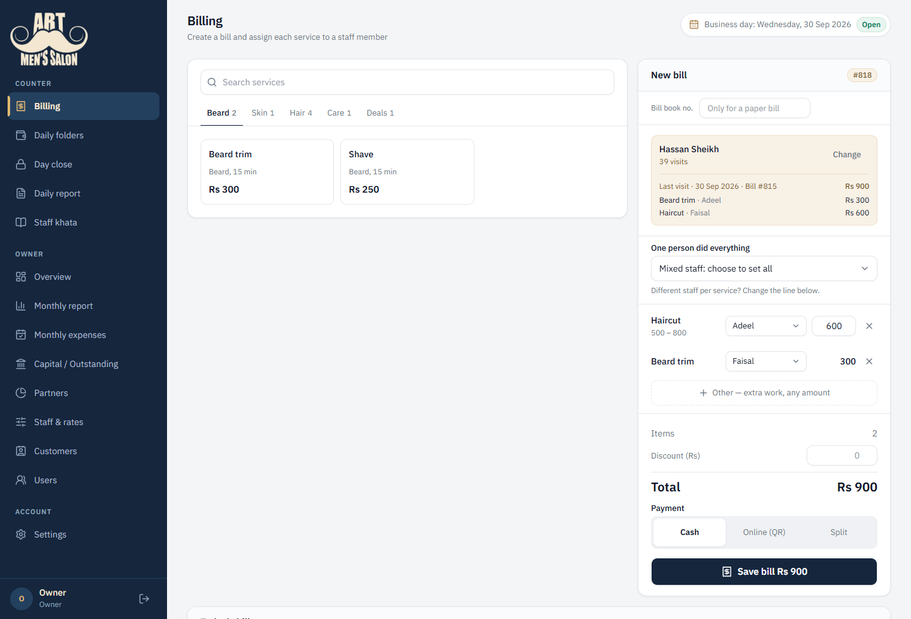
      <p><b>Billing</b> — a bill in progress: a service priced inside its range, staff per line, and the returning customer's last visit.</p>
    </td>
    <td width="50%" valign="top">
      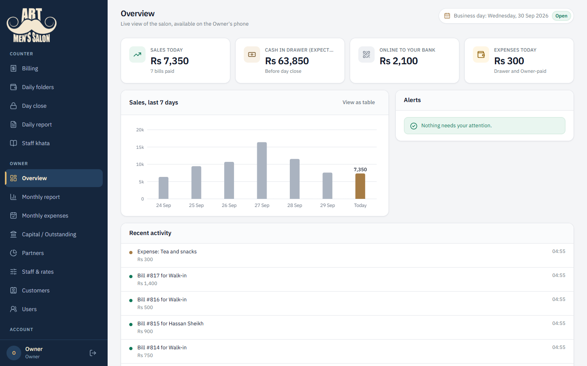
      <p><b>Overview</b> — the owner's live view: today's sales, the cash the drawer should hold, a seven-day chart and recent activity.</p>
    </td>
  </tr>
  <tr>
    <td valign="top">
      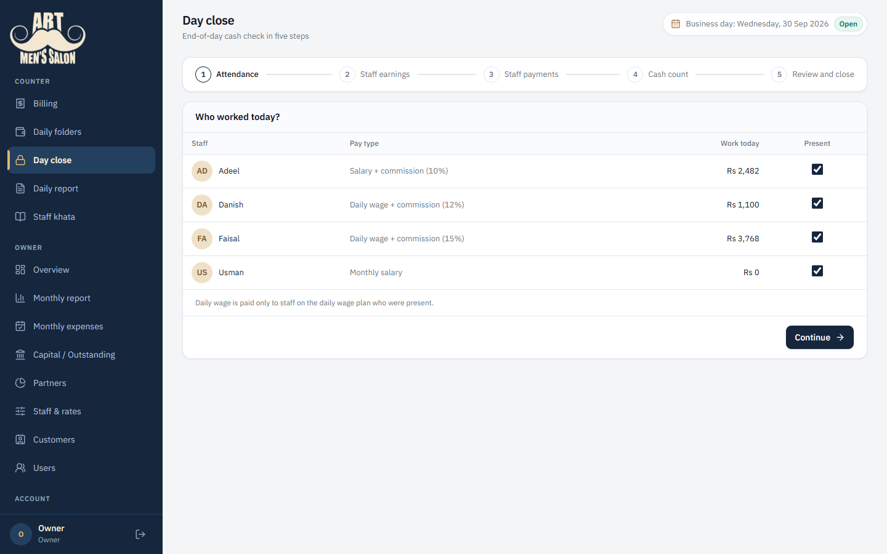
      <p><b>Day close</b> — the five-step wizard that ends every business day.</p>
    </td>
    <td valign="top">
      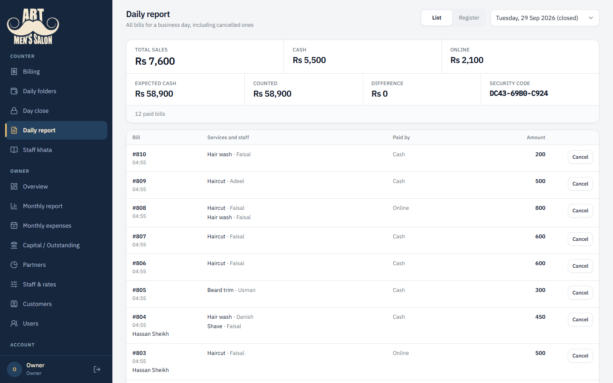
      <p><b>Daily report</b> — a sealed day: expected and counted cash, the difference, and its security code.</p>
    </td>
  </tr>
  <tr>
    <td valign="top">
      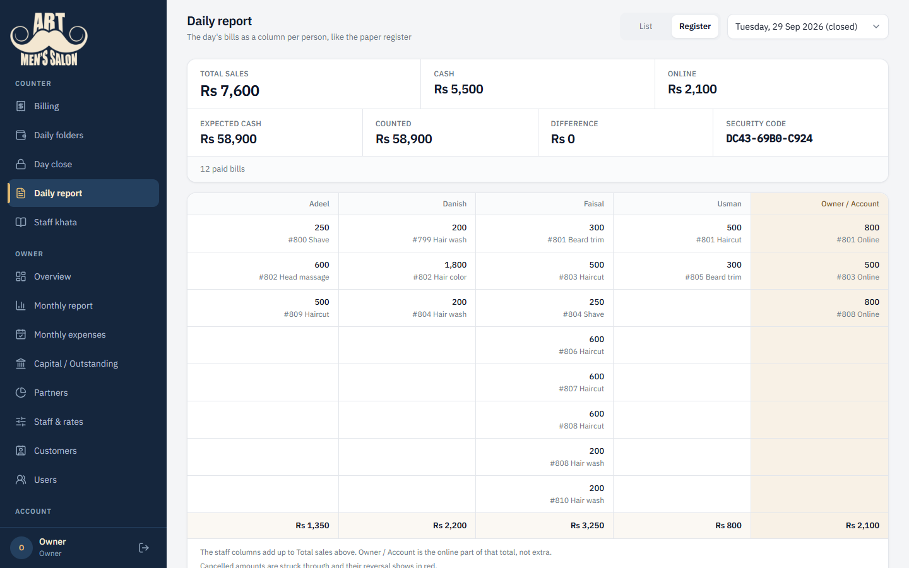
      <p><b>Register</b> — the same day as a column per staff member, like the paper register it replaced.</p>
    </td>
    <td valign="top">
      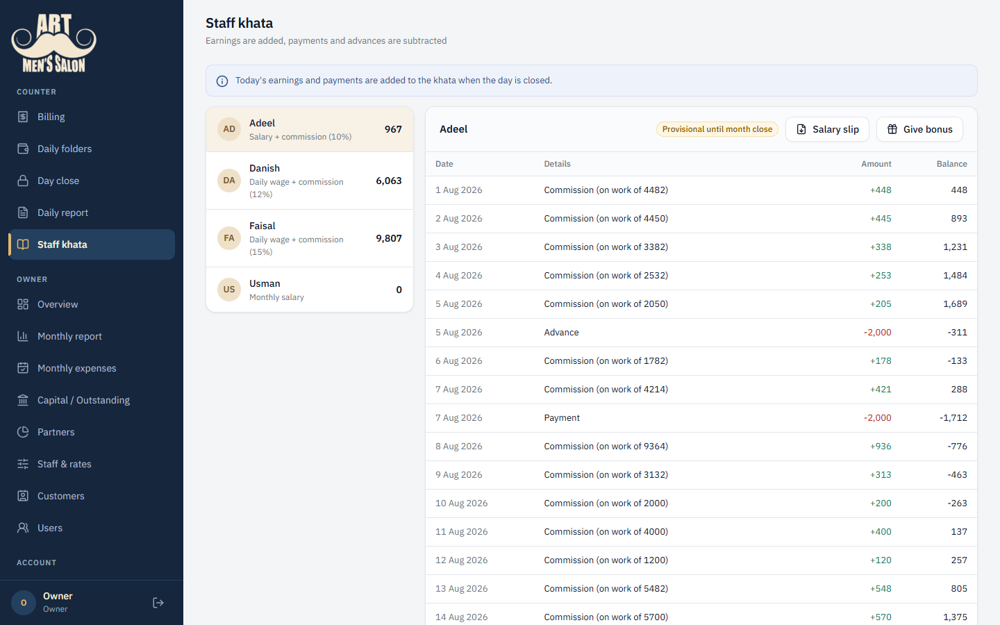
      <p><b>Staff khata</b> — each staff member's running ledger, with a monthly salary slip as a PDF.</p>
    </td>
  </tr>
  <tr>
    <td valign="top">
      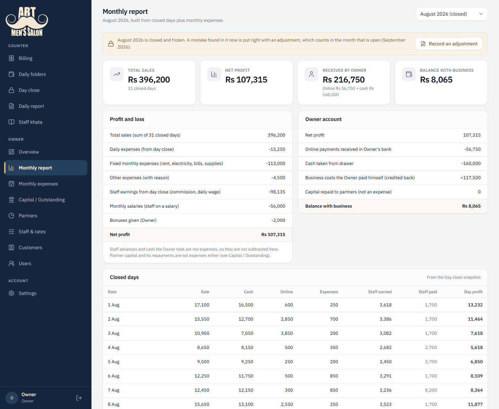
      <p><b>Monthly report</b> — a closed month: profit and loss, the owner account, and every sealed day.</p>
    </td>
    <td valign="top">
      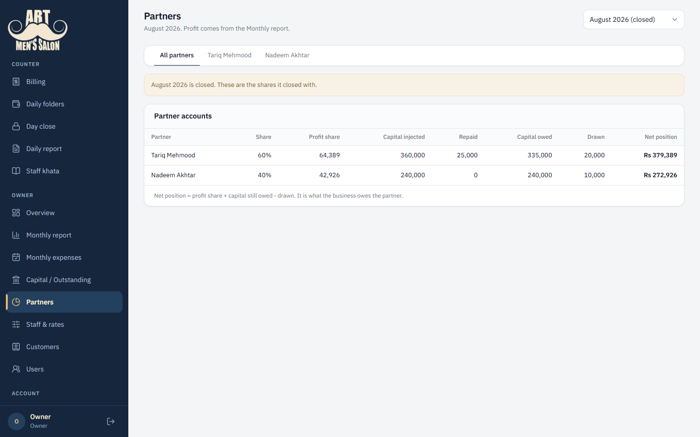
      <p><b>Partners</b> — profit shares frozen at month close, capital injected and repaid, drawings, net position.</p>
    </td>
  </tr>
</table>

<p align="center">
  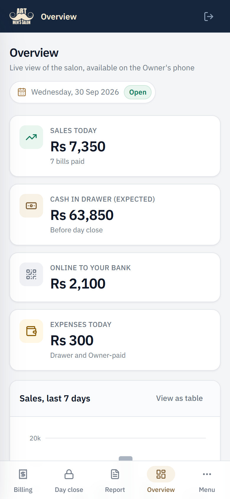
  &nbsp;&nbsp;&nbsp;
  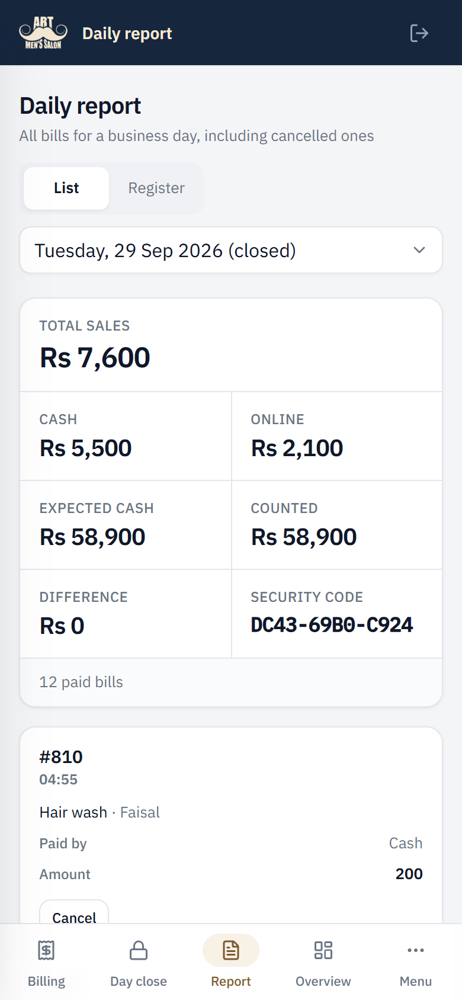
  <br />
  <sub><b>On a phone</b> — a top bar, a bottom bar for the counter's four screens, and tables that turn into cards.</sub>
</p>

---

## Highlights

- **Financial records are append-only, enforced by the database.** PostgreSQL triggers refuse any `UPDATE`
  or `DELETE` on bills, cash entries, ledgers, snapshots and month closes. A mistake is fixed by a
  cancellation plus a reversing entry, so every change stays on the record. No bug in the application can
  bypass it.
- **A tamper-evident chain of daily security codes.** Closing a day hashes (SHA-256) its figures, every bill,
  line and cash entry, and the previous day's code. Change anything in a sealed day and its code — and the
  chain after it — no longer verifies.
- **Offline-first PWA.** A service worker, an IndexedDB copy of the catalog and of the open day, and an
  outbox let the counter bill, record expenses and even close the day for 6–8 hours without internet. The
  server re-validates every queued item on sync and never trusts a price computed in the browser.
- **Exactly-once writes over an unreliable connection.** Every bill, cash entry, offline day close and Owner
  money entry (drawings, expenses, bonuses, capital, adjustments) carries a client-generated UUID backed by
  a unique index, so a request whose response was lost can be retried — or asked about — without ever
  saving twice. A cancellation is unique on the row it cancels, so two at once can never both land.
- **A pure, fully tested accounting core.** Pricing, deal splits, discounts, commission, day close, month
  report, partner shares and capital live in `src/lib/accounting` with no React and no database, in whole
  rupees (integers), using largest-remainder allocation so every split adds up to the rupee.
- **Architecture rules enforced by a test.** A conventions test reads the feature folders and fails the
  build if a feature imports another feature, a "pure" file grows a database import, or a pure file has no
  test beside it.
- **Audited, bounded escape hatch.** A maintainer role can correct a bill in place through a
  transaction-scoped setting (`set_config(..., is_local => true)`) that the triggers honour and that dies
  with the transaction. The audit log and snapshot history can never be opened, even by it; every change
  writes its before and after, the day is re-settled and a closed month's report and partner shares are
  recalculated.

---

## Features

### Counter (Manager and Owner)

| Area | What it does |
|---|---|
| **Billing** | Services, deals (bundles whose price is split across their services for commission), price ranges chosen at the counter, per-customer special rates, an "Other" line for ad-hoc work, whole-bill discounts with a required reason, cash / online / split payment, paper bill-book numbers for bills written during an outage |
| **Customers at the counter** | Phone lookup that shows the customer's last visit — what was done and by whom |
| **Receipts** | Printed from the same markup shown on screen (thermal-printer friendly print CSS), and reprinted from Today's bills |
| **Today's bills** | The counter's working list with cancel (reason required); the Owner can correct a bill on the open day |
| **Daily folders** | Expenses (paid from the drawer or by the owner), staff advances, owner cash in/out confirmed with the Owner's PIN; every entry cancellable with a reversing row |
| **Day close** | A five-step wizard: attendance for daily-wage staff, staff payments, cash count, expected vs counted cash with the difference explained, then the sealed snapshot and its security code |
| **Daily report** | The day's bills folded so a correction reads as one line with an "Edited" badge and a link to earlier versions; a read-only register view (per-staff columns, like the paper register); cancellation alerts |
| **Staff khata** | Each staff member's running ledger — commission, daily wage, monthly salary, bonuses, advances, payments — and a **monthly salary slip PDF** generated on the server |

### Owner

| Area | What it does |
|---|---|
| **Overview** | Live figures for the open day, a sales chart and alerts, readable from a phone |
| **Monthly report** | Profit and loss built from sealed days plus monthly expenses and salaries, the owner account (what reached the owner, what the business holds), day-by-day table |
| **Month close** | Freezes the month's report and each partner's share, posts monthly salaries to the ledgers; refused until the month's last day is closed |
| **Adjustments for a closed month** | A mistake found after a month closed counts in the open month — as a sale, an expense, or what a staff member earned or took — never by editing the closed one |
| **Monthly expenses** | Recurring fixed lines (rent, electricity…) and one-off expenses, paid by the business or by the owner |
| **Partners and capital** | Profit shares by percentage, drawings, capital injected and repaid, each partner's net position |
| **Staff and rates** | Services, deals, price ranges, three pay types (salary, salary + commission, daily wage + commission) |
| **Customers** | Names, numbers and special rates |
| **Users** | Create Owner and Manager logins, close and reopen accounts |

### Maintainer (developer role)

Audit log viewer with search, password and PIN resets, a one-click maintenance mode that closes the app to
everyone else, and the audited in-place bill correction described above.

### Across the app

Responsive layout designed at 375, 768 and 1440 px (a drawer and bottom bar on phones, tables that turn into
cards), an offline banner and outbox status on every screen, error and loading boundaries, Karachi business
dates regardless of the server's time zone, and every sign-in attempt — successful or not — in the audit log.

---

## Roles and permissions

Staff (the *karigars*) never sign in; their work is recorded by the counter.

| Action | Manager | Owner | Developer |
|---|:---:|:---:|:---:|
| Billing, daily folders, day close, daily report, staff khata | ✓ | ✓ | ✓ |
| Cancel a bill or entry on the open day | ✓ | ✓ | ✓ |
| Correct a bill on the open day | — | ✓ | ✓ |
| Cancel in a closed day, reopen the latest day (month still open) | — | ✓ | ✓ |
| Rates, deals, staff pay, customers, bonuses | — | ✓ | ✓ |
| Monthly report, month close, adjustments, partners, capital | — | ✓ | ✓ |
| Create users | — | ✓ | ✓ |
| Reset passwords and the Owner's PIN, maintenance mode, audit log | — | — | ✓ |
| Correct a bill in place on any day (audited) | — | — | ✓ |
| Delete a financial entry | — | — | — |

Permission is checked next to the data — in every Server Action and page — not only in the edge proxy, which
can see a cookie but not a session.

---

## How a day and a month work

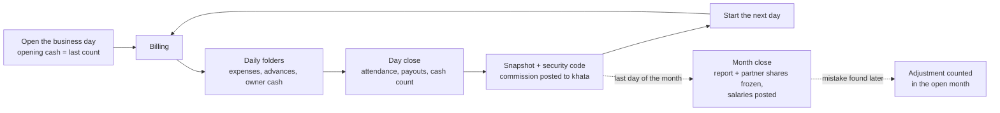

- **Expected cash** = opening cash + cash sales − drawer expenses − staff advances and payments − cash the
  owner took + cash the owner added.
- **Commission** is paid on what the customer actually paid: a discount is shared across the bill's lines, and
  a deal's price is split across its services by list price, so each staff member's share is exact.
- **Net profit** = sales − daily expenses − monthly expenses − staff earnings (commission, wages, salaries,
  bonuses) ± adjustments for earlier months. Advances and owner withdrawals are not costs and never appear.

---

## Keeping the books honest

| Mechanism | How it works |
|---|---|
| **Append-only tables** | `BEFORE UPDATE OR DELETE` triggers on every financial table. Configuration (services, staff, rates) stays editable and applies forward only. |
| **Corrections by reversal** | Cancelling a bill writes a cancellation and a mirrored negative bill. Cancelling inside a closed day re-settles it: earnings are reversed and re-posted, a new snapshot and code are written, and the counted cash is never rewritten — only what was *expected* moves. |
| **Reopening a day** | Only the latest day, only by the Owner, only while its month is open. Everything the close wrote is reversed, and the old closing record and code are archived for good. |
| **Security code chain** | SHA-256 over the day's figures, bills, lines, cash entries and the previous day's code. Any sealed day can be re-verified against its data. |
| **Audit log** | Every sign-in, cancellation, correction, reset and setting change with actor, target, before and after. Its trigger can never be opened. |
| **Frozen months** | A closed month keeps the report and shares it closed with, so later changes to salaries or percentages cannot alter it. |
| **Maintainer hatch** | A transaction-local setting lets exactly one code path (`src/db/financial-edit.ts`) change a bill in place; it is shut again as soon as the rows are written. |

---

## Working offline

The client needed the counter to keep working through 6–8 hour internet outages.

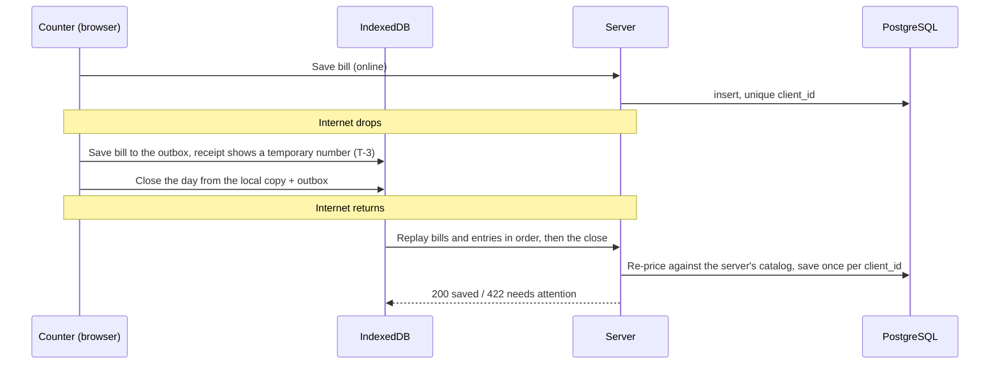

- **Service worker** keeps the app's static files and four static offline pages (Billing, Daily folders,
  the register, Day close). Server-rendered pages are never cached, so no one sees yesterday's figures as
  today's.
- **IndexedDB** holds a versioned copy of the catalog (services, deals, prices, staff, customers and their
  special rates), a copy of the open day, and the **outbox**, which nothing empties except the server
  accepting an item or a person removing it with a reason.
- **Ordering:** a day's close waits in the outbox behind that day's bills and entries, and the server closes
  the day only if its own expected cash matches the figure the cash was counted against.
- **Sessions:** an offline sign-in lasts 12 hours from the last one the server confirmed. "Online" means the
  server answered a probe, not that the browser thinks it has a network.

---

## Architecture

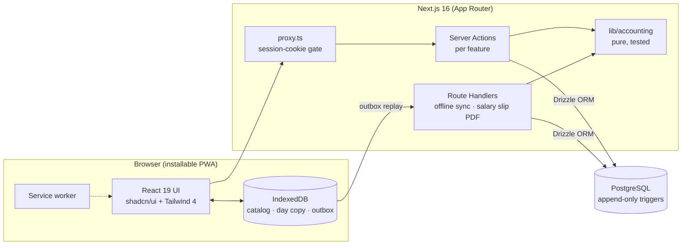

```
src/
  app/                 Routes. Pages are thin: they call a feature's queries and render its components.
    (app)/             Signed-in screens            (auth)/login   The only signed-out page
    offline-*/         Static offline pages         api/           Auth, offline sync, salary slip PDF
  features/<name>/     One folder per feature (18):
    actions.ts           "use server" — role check first, Zod, then the service
    service.ts           Transactions, writes, audit entries
    queries.ts           Reads for the page
    schemas.ts / types.ts
    <rule>.ts            Pure feature logic, each with a test beside it
    components/          UI for this feature only
  components/          Shared UI, the app shell, the offline plumbing; ui/ holds shadcn primitives
  lib/
    accounting/        Pricing, commission, deals, khata, day close, month report, partners, capital
    auth/              Roles, sessions, Better Auth
    offline/           Catalog and day copies, the outbox, temporary receipt numbers
  db/
    schema/            Drizzle tables by area         queries/   Reads shared by several features
    day-settlement.ts  Settle / re-settle a day        financial-edit.ts   The only hatch
drizzle/               SQL migrations, including the hand-written triggers
scripts/               Developer seed, database check, backup
```

Rules the codebase keeps (and a test checks): money logic lives only in `lib/accounting`; money is whole
rupees as integers; components never talk to the database; a feature never imports another feature; every
accounting change comes with a test.

---

## Data model

Thirty tables in PostgreSQL, grouped by purpose:

| Group | Tables |
|---|---|
| **Configuration** (editable) | `services`, `deals`, `deal_items`, `staff`, `customers`, `customer_special_rates`, `partners`, `fixed_expense_lines`, `app_settings` |
| **Money** (append-only) | `bills`, `bill_lines`, `bill_cancellations`, `cash_entries`, `khata_entries`, `monthly_expenses`, `partner_drawings`, `capital_items`, `capital_contributions`, `capital_repayments`, `month_adjustments` |
| **Days and months** | `business_days`, `attendance`, `day_snapshots`, `day_snapshot_history`, `month_closes` |
| **People and record** | `user`, `session`, `account`, `verification` (Better Auth), `audit_log` |

The growing tables are indexed for the queries that read them; tables that gain a few rows a month are
deliberately left unindexed.

---

## Tech stack

| Layer | Choice |
|---|---|
| Framework | [Next.js 16](https://nextjs.org) (App Router, Turbopack, Server Actions) with React 19 |
| Language | TypeScript 5 (strict) |
| Database | PostgreSQL (Neon in production), [Drizzle ORM](https://orm.drizzle.team) and drizzle-kit migrations, `pg` driver |
| Auth | [Better Auth](https://www.better-auth.com) — username and password, scrypt hashes, database sessions |
| Validation | Zod 4, one schema shared by each form and its Server Action |
| UI | Tailwind CSS 4, shadcn/ui on Base UI, lucide icons |
| Offline | Hand-written service worker, IndexedDB, Web App Manifest |
| Documents | `pdf-lib` for salary slips on the server; browser print CSS for receipts |
| Testing | Vitest |
| CI | GitHub Actions — lint, test and build on every push |
| Hosting | Vercel + Neon |

---

## Getting started

**Prerequisites:** Node.js 20.9 or newer (22 LTS recommended), pnpm (the repo pins its version — `corepack
enable` picks it up), and a PostgreSQL database of your own: a free [Neon](https://neon.tech) project or a
local PostgreSQL 16+.

```bash
git clone https://github.com/Sakib543/art-man.git
cd art-man
pnpm install
cp .env.example .env.local        # fill in the values below
pnpm db:migrate                   # create the tables, indexes and triggers
pnpm db:seed:developer            # the first account — its password is printed once
pnpm dev                          # http://localhost:3000
```

| Variable | Purpose |
|---|---|
| `DATABASE_URL` | Connection string the app uses (Neon's pooled string; a plain one for local PostgreSQL, without `sslmode`) |
| `DATABASE_URL_UNPOOLED` | Used by migrations only — Neon's direct string. Optional; falls back to `DATABASE_URL` |
| `BETTER_AUTH_SECRET` | Signs sessions. Generate one: `node -e "console.log(require('crypto').randomBytes(32).toString('base64url'))"` |
| `BETTER_AUTH_URL` | The app's own URL, e.g. `http://localhost:3000` |

Sign in as `developer`. There is deliberately only one seed: from the screens, the developer creates the
Owner and the Manager, sets the Owner's PIN, and the services, staff, partners and fixed expenses are entered
where they belong. The first business day is opened from Day close.

> Always run migrations with `pnpm db:migrate`, never a schema push: the append-only triggers live in
> hand-written SQL migrations, and a push would create the tables without them.

---

## Scripts

| Command | What it does |
|---|---|
| `pnpm dev` | Development server |
| `pnpm build` / `pnpm start` | Production build and server (the service worker only registers in production) |
| `pnpm test` / `pnpm test:watch` | Unit tests |
| `pnpm lint` | ESLint (Next.js core-web-vitals and TypeScript rules) |
| `pnpm db:generate` | Generate a migration after changing `src/db/schema` |
| `pnpm db:migrate` | Apply migrations |
| `pnpm db:studio` | Drizzle Studio |
| `pnpm db:seed:developer` | Create the developer account (skips if one exists) |
| `pnpm db:check` | Check the connection, the applied migrations against the repo, and the accounts |
| `pnpm db:backup` | Full `pg_dump` backup to `backups/` (git-ignored) |

---

## Testing and quality

- **729 tests in 52 files**, all pure — no database, no network — so they run in seconds and in CI with no
  secrets. They cover pricing (deals, ranges, special rates, discounts), commission and staff pay, the day
  close and expected cash, the security code, month reports and closed-month recalculation, partner shares,
  adjustments, offline outbox ordering and sync outcomes, temporary receipt numbers, the 12-hour offline
  session, sign-in error messages, the proxy's redirects, role rules and the salary slip.
- **Property-style checks** where it matters: for example, recalculating a closed month from corrected days
  must equal building the report from scratch, across every shape of month.
- **Conventions test** keeps the architecture from drifting (see [Architecture](#architecture)).
- **CI** runs lint, tests and a production build on every push to `main` and on pull requests.
- Features that touch money were also verified end to end against a **restored copy of the production
  database** in a throwaway local PostgreSQL, so verification never writes to the real books.

---

## Deployment and backups

- **Hosting:** Vercel builds from `main`; the database is Neon PostgreSQL. A migration is applied to the
  database before the code that needs it is pushed. Step-by-step guide: [docs/DEPLOY_VERCEL.md](docs/DEPLOY_VERCEL.md).
- **Backups:** `pnpm db:backup` writes a `pg_dump` custom-format file that restores with `pg_restore`,
  migration history included. Restores have been verified; see [docs/BACKUP.md](docs/BACKUP.md).

---

## Documentation

| Document | Contents |
|---|---|
| [docs/Art_Salon_Dev_Spec.md](docs/Art_Salon_Dev_Spec.md) | The business rules — the contract the app implements |
| [docs/ARCHITECTURE.md](docs/ARCHITECTURE.md) | Where code goes and why |
| [docs/BACKLOG.md](docs/BACKLOG.md) | Every piece of work, with the decisions taken and how it was verified |
| [docs/HANDOFF.md](docs/HANDOFF.md) | Working agreement, verified facts about the codebase, and known traps |
| [docs/DEPLOY_VERCEL.md](docs/DEPLOY_VERCEL.md) | Deploying to Vercel and Neon |
| [docs/BACKUP.md](docs/BACKUP.md) | Backup and restore |
| [docs/PROJECT_GUIDE.md](docs/PROJECT_GUIDE.md) | A walkthrough for the salon's side, in Roman Urdu |

---

## Project status

All planned features are built: billing, day close, daily and monthly reporting, staff ledgers and salary
slips, partners and capital, closed-month adjustments, the maintainer tools, and full offline support.
Remaining work is operational — a clean production database for the client's trial and a move to a VPS
with scheduled off-site backups.

---

## Authors

Built for a client — a men's salon in Karachi — from an approved specification and prototype.

- **Moin Khan ([@msdevs6600](https://github.com/msdevs6600))** built the first version: the project setup,
  the database schema and append-only triggers, the accounting module, and the core screens — billing,
  daily folders, day close with its security code, the daily report and register, staff khata, overview,
  monthly report, partners and month close.
- **[@Sakib543](https://github.com/Sakib543)** took it to production: the developer role and its tools,
  users and account management, reopening days and correcting closed days, bill corrections, discounts,
  price ranges, customers and special rates, receipt printing, bonuses, salary slips, closed-month
  adjustments and recalculation, the complete offline mode, exactly-once saving, the design system and
  responsive layout, CI, indexing, backups and deployment.

The code is shared here as a portfolio piece. No license is granted for reuse.
